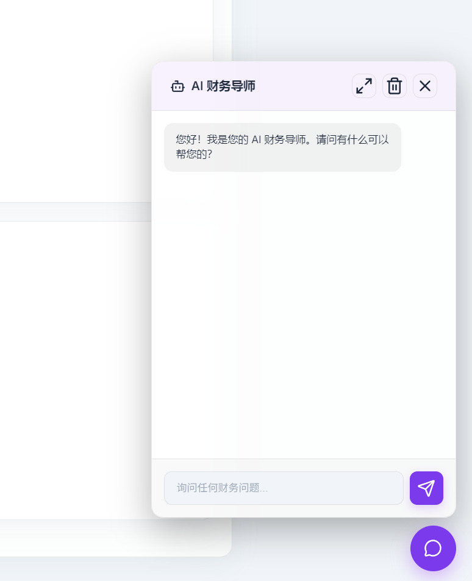
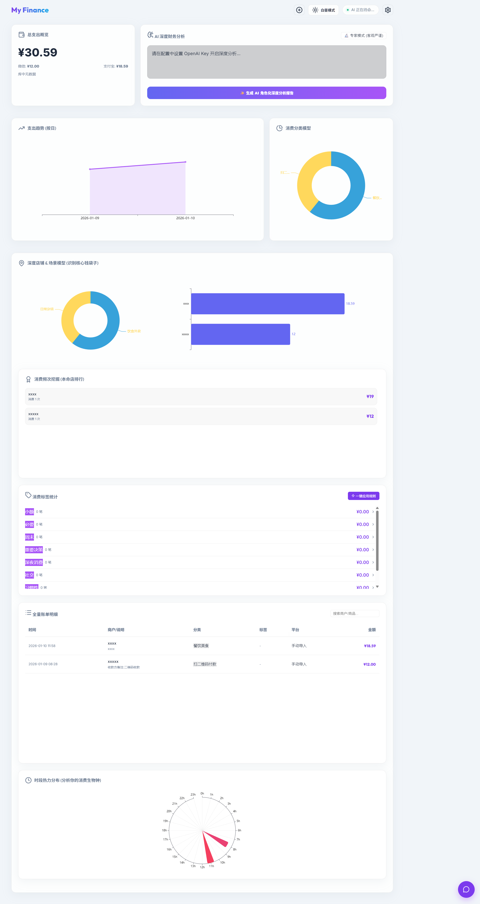

# My Finance

> 基于 AI + 规则引擎驱动的深度财务审计系统。
> 摆脱记账负担，通过账单导出文件一键开启“生命成本”视角。

---

[](LICENSE)
[](https://github.com/your-username/my-finance)

## 1. 多源数据一键聚合

支持 微信/支付宝 导出的原生流水文件（Excel/CSV）。支持多文件拖拽批量识别，自动清洗不同格式的交易字段。

### 2. AI 财务导师 (Agentic Chat)

集成 OpenAI Function Calling 技术。你可以直接问它：

- “上个月我在瑞幸花了多少钱？”
- “帮我找出那些超过 100 元的非必要支出。”
- “对比一下本周和上周的餐饮消费差异。”
  AI 会自主生成 SQL 查询本地数据库并给出专业的复盘建议。

### 3. 规则引擎打标系统 

预置 9 类自动化打标规则，无需 AI 消耗 Token：

- 小额/重要决策（金额维度）
- 深夜消费/周末（时间维度）
- 习惯性/健康/投资自己（关键词识别）

### 4. “生命成本”换算

独特的 时薪换算视角。系统会根据你的净时薪将消费金额换算为“生命时间耗费”，让你直观感受到每一笔消费背后付出的工作量。

### 5. 影子流水自动过滤

内置逻辑自动识别并折叠内部转账、理财进出、信用卡还款等“虚假支出”，真实还原你的现金流消耗。

---

## 技术栈

- 前端：原生 JS (ES6+) + Vite + Vanilla CSS (Premium Glassmorphism Design)
- 可视化：Apache ECharts (深度定制时段热力、消费脉冲、场景模型)
- 后端：Node.js + Express
- 数据库：Better-SQLite3 (全本地存储，保护财务私密)
- AI 能力：OpenAI API (兼容模型)

---

## 快速启动

### 1. 克隆项目

```bash
git clone https://github.com/your-username/my-finance.git
cd my-finance
```

### 2. 安装依赖

```bash
npm install
```

### 3. 环境配置

在根目录创建 .env 文件（可选，也可以在 Web UI 中配置）：

```env
OPENAI_API_KEY=your_key_here
OPENAI_BASE_URL=https://api.openai.com/v1
AI_MODEL=gpt-4o-mini
```

### 4. 运行

开启后端服务（端口 3000）：

```bash
npm run server
```

开启前端开发环境：

```bash
npm run dev
```

---

## 界面预览






---

## 隐私声明

本项目高度重视数据私密。您的账单数据仅存储在本地 finance_data.db 文件中。只有在您主动点击 AI 相关功能时，系统才会发送经过模糊处理的统计摘要给 AI 接口。

---

## 📄 许可证

[MIT License](LICENSE)

---

*Created by My Finance Project*
